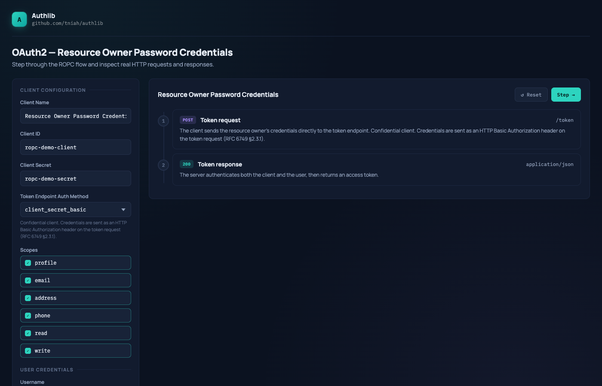

# Resource Owner Password Credentials — Example

An interactive playground demonstrating the OAuth 2.0 Resource Owner Password Credentials grant
([RFC 6749 §4.3](https://www.rfc-editor.org/rfc/rfc6749#section-4.3)) built with
[authlib](https://github.com/tniah/authlib).

> **Note:** ROPC is a legacy grant. For new integrations, prefer Authorization Code + PKCE.
> Use ROPC only when migrating existing systems or when no redirect-based flow is possible.



## Running

```bash
go run ./examples/rfc6749/ropc
```

Then open [http://localhost:9090](http://localhost:9090) in your browser.

### Environment variables

| Variable         | Default   | Description                    |
|------------------|-----------|--------------------------------|
| `SERVER_PORT`    | `9090`    | TCP port the server listens on |
| `SERVER_ADDRESS` | `0.0.0.0` | IP address to bind to          |

```bash
SERVER_PORT=8080 go run ./examples/rfc6749/ropc
```

## Endpoints

| Method | Path     | Description    |
|--------|----------|----------------|
| `GET`  | `/`      | Playground UI  |
| `POST` | `/token` | Token endpoint |

## Pre-seeded data

### Client

| Field                        | Value                                                    |
|------------------------------|----------------------------------------------------------|
| `client_id`                  | `ropc-demo-client`                                       |
| `client_secret`              | `ropc-demo-secret`                                       |
| `token_endpoint_auth_method` | `client_secret_basic`                                    |
| `grant_types`                | `password`                                               |
| `scopes`                     | `profile`, `email`, `address`, `phone`, `read`, `write` |

### User

| Username | Password |
|----------|----------|
| `alice`  | `secret` |

## Flow

```
1. POST /token  →  Token request (grant_type=password + user credentials + client auth)
2. HTTP 200     →  Server returns access token
```

The playground lets you edit the client credentials, username, password, and select scopes
before stepping through the flow — displaying the real HTTP request and response at each step.

## Playground features

- **Editable fields**: `client_id`, `client_secret`, `username`, `password`
- **Auth method selector**: switch between `none`, `client_secret_basic`, and `client_secret_post`
- **Scope toggle**: click individual scopes to include or exclude them from the request
- **Live preview**: the HTTP request display updates as you type

## Code structure

```
ropc/
├── main.go        # Entry point: reads config, starts HTTP server
├── server.go      # SetupServer: wires grant, registers routes
├── index.html     # Playground UI shell
└── static/
    └── app.js     # Flow logic and rendering
```

Shared static assets (fonts, CSS) are served from `examples/assets/`.
