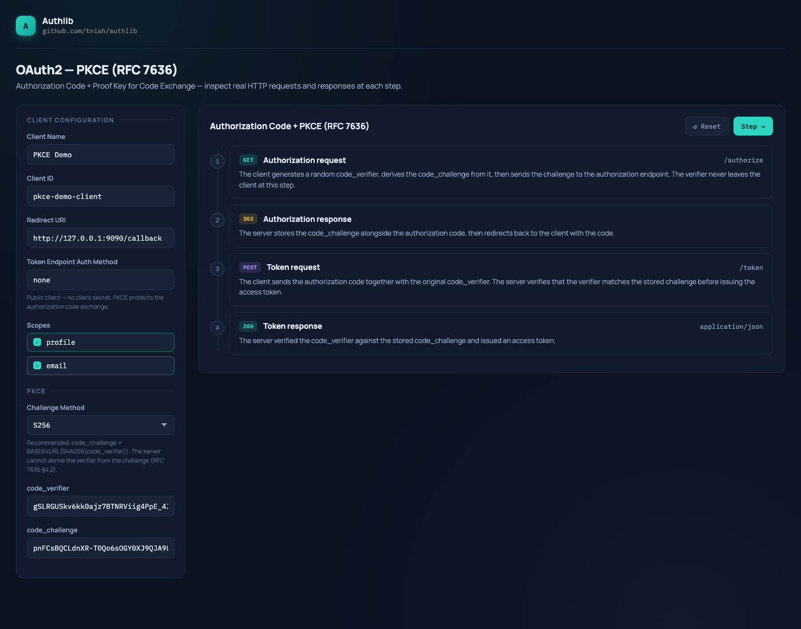

# PKCE — Example

An interactive playground demonstrating Proof Key for Code Exchange
([RFC 7636](https://www.rfc-editor.org/rfc/rfc7636)) built with
[authlib](https://github.com/tniah/authlib).

The example extends the Authorization Code grant (RFC 6749 §4.1) with PKCE:
the client generates a `code_verifier`, derives a `code_challenge` from it, and
sends the challenge at the authorization step. At the token step the server
verifies the original `code_verifier` matches the stored challenge before issuing
an access token — preventing authorization code interception attacks.



## Running

```bash
go run ./examples/rfc7636
```

Then open [http://localhost:9090](http://localhost:9090) in your browser.

### Environment variables

| Variable         | Default   | Description                    |
|------------------|-----------|--------------------------------|
| `SERVER_PORT`    | `9090`    | TCP port the server listens on |
| `SERVER_ADDRESS` | `0.0.0.0` | IP address to bind to          |

```bash
SERVER_PORT=8080 go run ./examples/rfc7636
```

## Endpoints

| Method | Path         | Description            |
|--------|--------------|------------------------|
| `GET`  | `/`          | Playground UI          |
| `GET`  | `/authorize` | Authorization endpoint |
| `POST` | `/token`     | Token endpoint         |

## Pre-seeded data

### Client

| Field                        | Value                                            |
|------------------------------|--------------------------------------------------|
| `client_id`                  | `pkce-demo-client`                               |
| `token_endpoint_auth_method` | `none` (public client)                           |
| `grant_types`                | `authorization_code`                             |
| `response_types`             | `code`                                           |
| `scopes`                     | `profile`, `email`                               |
| `redirect_uris`              | `http://<SERVER_ADDRESS>:<SERVER_PORT>/callback` |

### User

| Username | Password |
|----------|----------|
| `alice`  | `secret` |

> The `/authorize` endpoint skips the login screen and authenticates as alice
> automatically, simulating an already logged-in session.

## Flow

```
1. GET /authorize  →  Authorization request (+ code_challenge + code_challenge_method)
2. HTTP 302        →  Server stores challenge, redirects with authorization code
3. POST /token     →  Client sends code + code_verifier; server verifies the pair
4. HTTP 200        →  Server returns access token
```

The playground generates a fresh `code_verifier` on each load and reset, and
computes `code_challenge` in the browser using the Web Crypto API
(`crypto.subtle.digest`).

## Playground features

- **Challenge method selector**: switch between `S256` (recommended) and `plain`
- **Live PKCE params**: `code_verifier` and `code_challenge` are displayed and update when the method changes
- **Scope toggle**: click individual scopes to include or exclude them
- **Copy button**: copy the raw content of any code block to the clipboard
- **Timestamp tooltip**: hover over `iat` and `exp` values to see the human-readable date and time

## Code structure

```
rfc7636/
├── main.go        # Entry point: reads config, starts HTTP server
├── server.go      # SetupServer: wires Authorization Code grant + PKCE extension, registers routes
├── index.html     # Playground UI shell
└── static/
    └── app.js     # Flow logic, PKCE generation, and rendering
```

Shared static assets (fonts, CSS) are served from `examples/assets/`.
