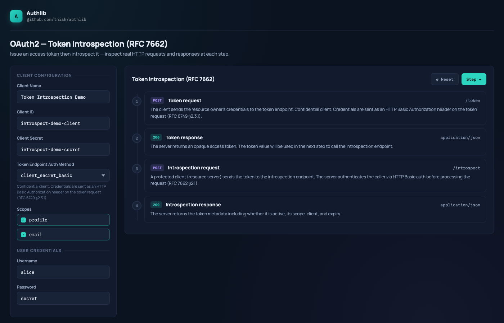

# Token Introspection — Example

An interactive playground demonstrating OAuth 2.0 Token Introspection
([RFC 7662](https://www.rfc-editor.org/rfc/rfc7662)) built with
[authlib](https://github.com/tniah/authlib).

The example uses the Resource Owner Password Credentials grant (RFC 6749 §4.3) to issue a token,
then introspects it via a dedicated endpoint. Both the grant and the introspection endpoint share
the same in-memory token store so that issued tokens are immediately visible to the introspector.



## Running

```bash
go run ./examples/rfc7662
```

Then open [http://localhost:9090](http://localhost:9090) in your browser.

### Environment variables

| Variable         | Default   | Description                    |
|------------------|-----------|--------------------------------|
| `SERVER_PORT`    | `9090`    | TCP port the server listens on |
| `SERVER_ADDRESS` | `0.0.0.0` | IP address to bind to          |

```bash
SERVER_PORT=8080 go run ./examples/rfc7662
```

## Endpoints

| Method | Path          | Description                  |
|--------|---------------|------------------------------|
| `GET`  | `/`           | Playground UI                |
| `POST` | `/token`      | Token endpoint               |
| `POST` | `/introspect` | Token introspection endpoint |

## Pre-seeded data

### Client

| Field                        | Value                    |
|------------------------------|--------------------------|
| `client_id`                  | `introspect-demo-client` |
| `client_secret`              | `introspect-demo-secret` |
| `token_endpoint_auth_method` | `client_secret_basic`    |
| `grant_types`                | `password`               |
| `scopes`                     | `profile`, `email`       |

### User

| Username | Password |
|----------|----------|
| `alice`  | `secret` |

## Flow

```
1. POST /token      →  Token request (grant_type=password + user credentials + client auth)
2. HTTP 200         →  Server returns access token; token is stored in memory
3. POST /introspect →  Introspection request (token + token_type_hint=access_token + client auth)
4. HTTP 200         →  Server returns token metadata (active, scope, client_id, exp, iat, …)
```

The playground steps through each stage and displays the real HTTP request and response.
Hover over `exp` and `iat` values in the introspection response to see the human-readable
date and time.

## Playground features

- **Editable fields**: `client_id`, `client_secret`, `username`, `password`
- **Auth method selector**: switch between `none`, `client_secret_basic`, and `client_secret_post`
- **Scope toggle**: click individual scopes to include or exclude them from the token request
- **Live preview**: the HTTP request display updates as you type
- **Timestamp tooltip**: hover over `iat` and `exp` to see the human-readable date and time
- **Copy button**: copy the raw content of any code block to the clipboard

## Code structure

```
rfc7662/
├── main.go        # Entry point: reads config, starts HTTP server
├── server.go      # SetupServer: wires ROPC grant + introspection endpoint, registers routes
├── index.html     # Playground UI shell
└── static/
    └── app.js     # Flow logic and rendering
```

Shared static assets (fonts, CSS) are served from `examples/assets/`.
