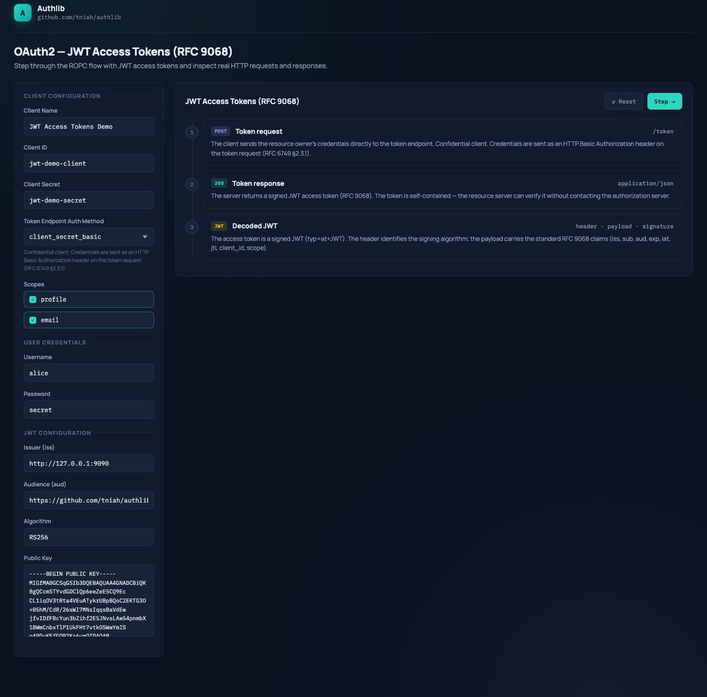

# JWT Access Tokens (RFC 9068) — Example

An interactive playground demonstrating JWT Access Tokens
([RFC 9068](https://www.rfc-editor.org/rfc/rfc9068)) built with
[authlib](https://github.com/tniah/authlib).

The example uses the Resource Owner Password Credentials grant (RFC 6749 §4.3) as the token
issuance mechanism, with a `JWTAccessTokenGenerator` plugged in via `BearerTokenGeneratorOptions`
to replace the default opaque access token with a signed JWT.



## Running

```bash
go run ./examples/rfc9068
```

Then open [http://localhost:9090](http://localhost:9090) in your browser.

### Environment variables

| Variable         | Default   | Description                    |
|------------------|-----------|--------------------------------|
| `SERVER_PORT`    | `9090`    | TCP port the server listens on |
| `SERVER_ADDRESS` | `0.0.0.0` | IP address to bind to          |

```bash
SERVER_PORT=8080 go run ./examples/rfc9068
```

## Endpoints

| Method | Path     | Description    |
|--------|----------|----------------|
| `GET`  | `/`      | Playground UI  |
| `POST` | `/token` | Token endpoint |

## Pre-seeded data

### Client

| Field                        | Value                 |
|------------------------------|-----------------------|
| `client_id`                  | `jwt-demo-client`     |
| `client_secret`              | `jwt-demo-secret`     |
| `token_endpoint_auth_method` | `client_secret_basic` |
| `grant_types`                | `password`            |
| `scopes`                     | `profile`, `email`    |

### User

| Username | Password |
|----------|----------|
| `alice`  | `secret` |

### JWT configuration

| Field       | Value                                 |
|-------------|---------------------------------------|
| Algorithm   | `RS256`                               |
| Key ID      | `demo-key-1`                          |
| Expires in  | `30 minutes`                          |
| Issuer      | `http://<SERVER_ADDRESS>:<SERVER_PORT>` |
| Audience    | `https://github.com/tniah/authlib`    |

The RSA 1024-bit key pair is stored in `keys/private.pem` and `keys/public.pem` and embedded into
the binary at compile time via `//go:embed`.

## Flow

```
1. POST /token  →  Token request (grant_type=password + user credentials + client auth)
2. HTTP 200     →  Server returns a signed JWT access token
3. Decoded JWT  →  header · payload · signature displayed client-side
```

The playground steps through the flow and displays the real HTTP request and response at each
stage. The third step decodes the JWT in the browser and shows the header and payload claims.

## Playground features

- **Editable fields**: `client_id`, `client_secret`, `username`, `password`
- **Auth method selector**: switch between `none`, `client_secret_basic`, and `client_secret_post`
- **Scope toggle**: click individual scopes to include or exclude them from the request
- **Live preview**: the HTTP request display updates as you type
- **JWT decoder**: step 3 base64url-decodes the token and renders header, payload, and signature
- **Timestamp tooltip**: hover over `iat` and `exp` values to see the human-readable date and time
- **Copy button**: copy the raw content of any code block to the clipboard

## Code structure

```
rfc9068/
├── main.go        # Entry point: reads config, starts HTTP server
├── server.go      # SetupServer: wires ROPC grant + JWT generator, registers routes
├── index.html     # Playground UI shell
├── keys/
│   ├── private.pem  # RSA 1024-bit private key (signing)
│   └── public.pem   # RSA 1024-bit public key (displayed in UI)
└── static/
    └── app.js     # Flow logic, JWT decoding, and rendering
```

Shared static assets (fonts, CSS) are served from `examples/assets/`.
